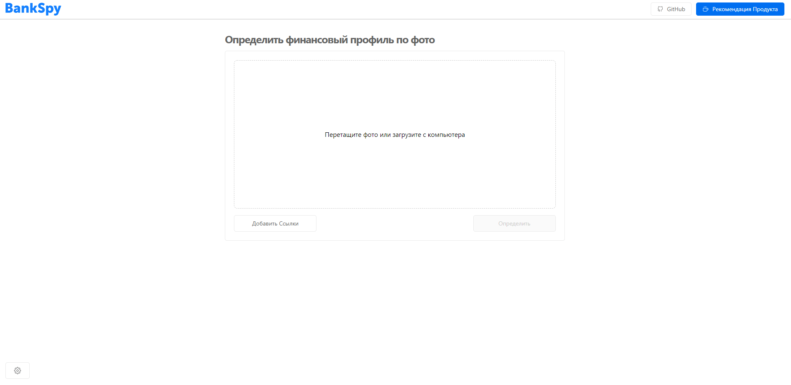
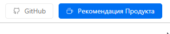
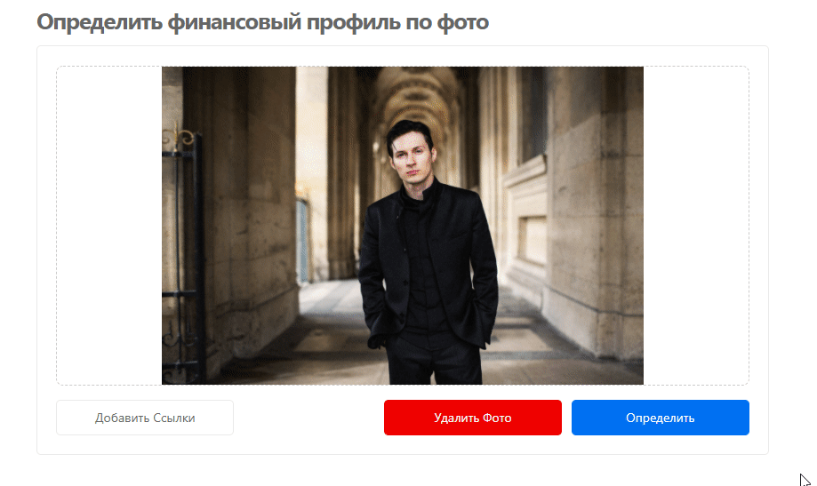
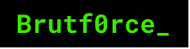

<h1 align="center"> 🛸 BankSpy 🛸 </h1>

  

<h2 align="center"><a target="_blank" href="https://scoring-system.vercel.app/">You can try it now!</a></h2>

## Навигация
- [Описание](#описание)
- [Как пользоваться системой](#как_пользоваться_системой)
- [О проекте и технологиях](#о_проекте_и_технологиях)
 - [Архитектура](#архитектура)
 - [Computer Vision & Machine Learning](#computer_vision_and_machine_learning)
 - [Frontend & Backend](#frontend_and_backend)
 - [UI/UX Design](#ui_ux_design)
 - [Рекомендательная система на основе Скорринга](#рекомендательная_система_на_основе_скорринга)
- [Планы на будущее](#планы_на_будущее)
 

 
## Описание

**Как работает система**

 
Проект создан для того, чтобы при посещении банка идентифицировать клиента и получить его финансовый профиль. На основании полученной информации о клиенте необходимо предложить максимально подходящие ему продукты. 
Система распознает не только клиента, но и его примерный возраст, чтобы максимально точно определить его примерные потребности в банковской сфере услуг.

**Над созданием проекта работают [Виктор](https://github.com/victor30608), [Алексей](https://github.com/kvandake), [Анна](https://github.com/elladiell), [Сергей](https://github.com/itboss2), [Кристина](https://www.behance.net/kmazanova6b1e)** .

 
## Как пользоваться системой

**Для ускорения работы с системой следует нажать на шестеренку в правом нижнем углу экранна и уменьшить значение.**

*Чтобы ознакомиться с моделью, по которой рассчитывалась рекомендательная система нужно нажать на кнопку **Рекомендация Продукта***

### Добавить в базу новый профиль:

- Нажимаем на кнопку **Добавить ссылки** и добавляем профиль пользователя для дальнейшего распознавания.

### Загрузка фотографии в систему:

- Загружаем фотографии человека, **перетащив фото** или **загрузив его с компьютера**;
- Чтобы загрузить новое фото пользователя, нужно нажать кнопку **Удалить Фото**.

### Поиск по профилю:

- Происходит автоматически после нажатия кнопки **Определить**.

### Поиск услуг:

- Для определения услуг, подходящих пользователю, нажимаем на всплывающем окне с информацией **Подобрать Услуги**.

 
## О проекте и технологиях.

 
### Архитектура

**Используемые API**:
- [ВК](https://vk.com/dev/methods)
- [Судебное производство от ФССП](https://api-ip.fssprus.ru/)

 
### Computer Vision & Machine Learning

Описание и важные вырезки кода технологии.
Возможно, картинки или графики.

 
### Frontend & Backend
*Frontend*
- [Typescript](https://www.typescriptlang.org/)
- [Next.JS](https://nextjs.org/)
- [React, React hooks](https://reactjs.org/)

*Backend*
- [SSR](https://vuejs.org/v2/guide/ssr.html)
- [Nginx](https://nginx.org/)

 
### UI/UX Design

Описание и важные детали разработки
Возможно, картинки или графики.

 
### Рекомендательная система на основе Скорринга

Описание и важные вырезки кода технологии.
Возможно, картинки или графики.

 
## Планы на будущее

- Добавить 1
- Добавить 2
- Добавить 3

