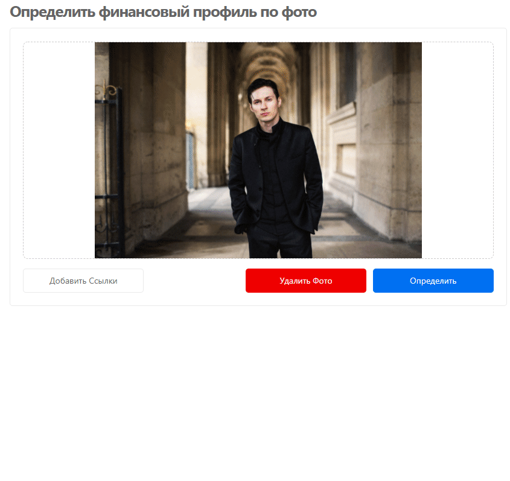
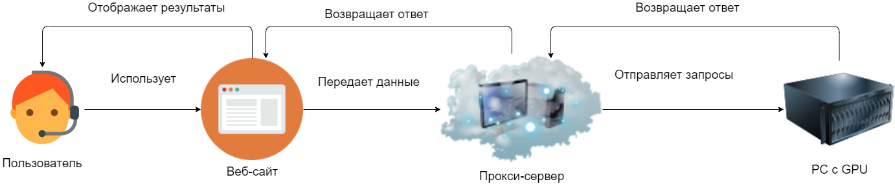

<h1 align="center"> 🛸 BankSpy 🛸 </h1>

<p align="center">  


</p>

<p align="center"></p>

<h2 align="center"><a target="_blank" href="https://scoring-system.vercel.app/">You can try it now!</a></h2>

## Навигация
- [Описание](#описание)
- [Как пользоваться системой](#как_пользоваться_системой)
- [О проекте и технологиях](#о_проекте_и_технологиях)
 - [Архитектура](#архитектура)
 - [Computer Vision & Machine Learning](#computer_vision_and_machine_learning)
 - [Frontend & Backend](#frontend_and_backend)
 - [UI/UX Design](#ui_ux_design)
 - [Рекомендательная система на основе Скорринга](#рекомендательная_система_на_основе_скорринга)
- [Планы на будущее](#планы_на_будущее)
 

<a name="описание"></a> 
## Описание

**Как работает система**

<p align="center">
</p> 
Проект создан для того, чтобы при посещении банка идентифицировать клиента по фото и получить его финансовый профиль. На основании полученной информации о клиенте необходимо предложить максимально подходящие ему продукты. 
Система распознает не только клиента, но и его примерный возраст, чтобы максимально точно определить его примерные потребности в банковской сфере услуг.


**Над созданием проекта работают [Кристина](https://www.behance.net/kmazanova6b1e), [Алексей](https://github.com/kvandake), [Анна](https://github.com/elladiell), [Сергей](https://github.com/itboss2), [Виктор](https://github.com/victor30608)** .

<a name="как_пользоваться_системой"></a> 
## Как пользоваться системой

**Для ускорения работы с системой следует нажать на шестеренку в левом нижнем углу экранна и уменьшить значение.**

*Чтобы ознакомиться с моделью, по которой рассчитывалась рекомендательная система нужно нажать на кнопку **Рекомендация Продукта***

<p align="center">
</p>

### Добавить в базу новый профиль:

- Нажимаем на кнопку **Добавить ссылки** и добавляем профиль пользователя для дальнейшего распознавания.

### Загрузка фотографии в систему:

- Загружаем фотографии человека, **перетащив фото** или **загрузив его с компьютера**;
- Чтобы загрузить новое фото пользователя, нужно нажать кнопку **Удалить Фото**.

### Поиск по профилю:

- Происходит автоматически после нажатия кнопки **Определить**.

### Поиск услуг:

- Для определения услуг, подходящих пользователю, нажимаем на всплывающем окне с информацией **Подобрать Услуги**.

<p align="center">
</p>


<a name="о_проекте_и_технологиях"></a> 
## О проекте и технологиях.


<a name="архитектура"></a> 
### Архитектура

<p align="left">
</p> 

**Взаимодействия Backend 'a и CV**:
Для задач CV поднят веб-сервер, который умеет обрабатывать 4 типа запросов:
1) ```/add_data```
- Добавление данных в базу
- Входные данные json - ```{"urls": ["vk.com/id1"],"count": "12"}```
- Выходные данные json -  "OK" ( информация о том, что профиль добавлен)
2) ```/search```
- Поиск по базе
- Входные данные json - ```{"url":"vk.com/image.jpg","thresh":"0.4"}```
- Выходные данные  json - ```{"id":"12345","count":"10","age":"23"}```
- *Id* - vk_Id
- *count* - количество фотографий, для которых косинусная метрика превысила порог,
- *age* - возраст
3) ```/get_info```
- Получение данных о конкретном пользователе
- Возвращает информации из API VK, API ФСИП + скоринг
- Входные данные json - ```{"id":"1"}```
- Выходные данные json - ```{"data":{...},"bdip":{..},"score":"15"}```
4) ```/get_recommend```
- Получение услуги на основе score
- Входные данные json - ```{"score":"value"}```
- Выходные данные Json - ```{"item":"продукт"}```

Действия пользователя оборачивается в методы, которые поддерживает CV-сервер.

**Используемые API**:
- [ВК](https://vk.com/dev/methods)
- [Судебное производство от ФССП](https://api-ip.fssprus.ru/)

<a name="computer_vision_and_machine_learning"></a> 
### Computer Vision & Machine Learning

**Технонологии**:
- [OpenCV](https://opencv.org/)
- [MXNet](https://mxnet.apache.org/)
- [InsightFace](https://github.com/deepinsight/insightface)

**Нейронные сети** :

- Face Detecton - [RetinaFace](https://arxiv.org/abs/1905.00641)
- Face Alignment - [DenseUNet](https://arxiv.org/abs/1709.07330)
- Face Recognition + Age - LResNet100E-IR

**Получение эмбеддинга** :

*Face Detecton -> Face Alignment -> Face Recognition*  

Поиск по выгруженным профилям:   
1) Получение эмбеддинга входного изображения;
2) Вычисление косинусного расстояние между данным эмбеддингом и всеми эмбеддингами для профилей из базы;
3) Сравнение полученного значения с пороговым значением, запоминая информация о том, сколько раз для конкретного профиля косинусное расстояние превысило порог;
4) Получение информации о профиле, у которого расстояние превысило пороговое значение наибольшее число раз. В случае, если поиск не дал результатов, следует уменьшить пороговое значение.

<a name="frontend_and_backend"></a> 
### Frontend & Backend
*Frontend*
- [Typescript](https://www.typescriptlang.org/)
- [Next.JS](https://nextjs.org/)
- [React.JS](https://reactjs.org/)

*Backend*
- [SSR](https://nextjs.org/docs/basic-features/data-fetching)
- [Nginx](https://nginx.org/)

<a name="ui_ux_design"></a> 
### UI/UX Design

Дизайн интерфейса создаввался с помощью [Figma](https://www.figma.com/)

<a name="рекомендательная_система_на_основе_скорринга"></a> 
### Рекомендательная система на основе скоринга

Скоринг был использован для расчета уровеня принятия рисков инвестиций (номер от 1 до 10, соответствующий диапазону суммы баллов скоринга) и приближен к модели поведенческого скоринга (используется для выдачи банковских кредитов). 
Когда ряд параметров финансового профиля клиента добавляют в общую сумму скоринга фиксированное кол-во баллов: от 0 до 15. 
При этом, чем **параметр важнее** - тем больше баллов он может добавить (это кол-во баллов также называется весом параметра). 
Максимальная сумма составляет **121**, минимальная - **0** баллов.

[Модель рекомендательной системы на базе персонального скоринга физлица](https://docs.google.com/document/d/1ZrVF1MYtpUCfFrrbusWM1GW5PMybiNOsh8IxZxRbVEk/edit)


<a name="планы_на_будущее"></a> 
## Планы на будущее

1) Добавление внешних API(yandex, facebook и другие сервисы по получению данных);
2) Возможное добавление обработки фотографий с их названиями на русском языке;
3) Подробный анализ изображения на фото: 
   - оценка стоимости одежды на человеке, 
   - поиск автомобильных номеров, 
   - использование информации о геолокации на фотографии

<p align="right" ></p>
