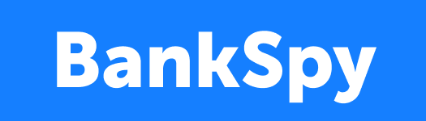

<h1 align="center">BankSpy</h1>

  

<h2 align="center"><a target="_blank" href="https://scoring-system.vercel.app/">You can try it now!</a></h2>

## Описание

**Как работает система**

 
Проект создан для того, чтобы при посещении банка идентифицировать клиента и получить его финансовый профиль для того. На основании полученной информации о клиенте необходимо предложить максимально подходящие ему продукты. 
Система распознает не только клиента, но и его примерный возраст, чтобы максимально точно определить его примерные потребности в банковской сфере услуг.

**Над созданием проекта работают [Виктор](https://github.com/victor30608), [Алексей](https://github.com/kvandake), [Анна](https://github.com/elladiell), [Сергей](https://github.com/itboss2), [Кристина](https://www.behance.net/kmazanova6b1e)** .

## Как пользоваться системой

**Для ускорения работы с системой следует нажать на шестеренку в правом нижнем углу экранна и уменьшить значение.**

### Добавить в базу новый профиль:

- Нажимаем на кнопку **Добавить ссылки** и добавляем профиль пользователя для дальнейшего распознавания.

### Загрузка фотографии в систему:

- Загружаем фотографии человека, **перетащив фото** или **загрузив его с компьютера**;
- Чтобы загрузить новое фото пользователя, нужно нажать кнопку **Удалить Фото**.

### Поиск по профилю:

- Происходит автоматически после нажатия кнопки **Определить**.

### Поиск услуг:

- Для определения услуг, подходящих пользователю, нажимаем на всплывающем окне с информацией **Подобрать Услуги**.

## О проекте и технологиях.

### Computer Vision & Machine Learning

Описание и важные вырезки кода технологии.
Возможно, картинки или графики.

### Frontend & Backend

Описание и важные вырезки кода технологии.
Возможно, картинки или графики.

  

### UI/UX Design

Описание и важные детали разработки
Возможно, картинки или графики.

### Рекомендательная система на основе Скорринга

Описание и важные вырезки кода технологии.
Возможно, картинки или графики.

## Планы на будущее

- Добавить 1
- Добавить 2
- Добавить 3

